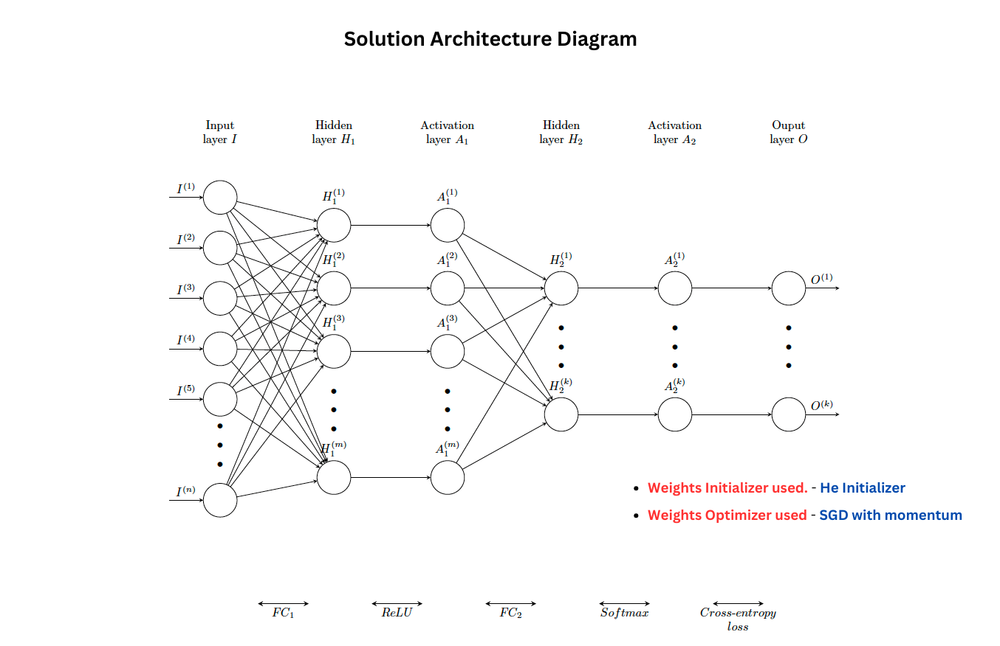

# AdvPT Project WS 2023: Handwriting Recognition (MNIST) in C++ (Group-47-OverFitters)

This repository provides a comprehensive implementation of Neural Network in C++ for the task of Handwriting recognition i.e. identify the the handwritten digits in the images.

## Code Structure

The repository is organized as follows:

- `src/Layers`: Contains the implementation of differnet layers in our network.  
>	1. "activations.cpp" : Implementations of forward and backward pass of 2 activation functions namely - ReLU and Softmax  
> 2. "fullyconnected.cpp" : Implementation of forward and backward pass of fully connected layers of the network 

- `src/Optimization`: Contains implementation of network optimization methods 
> 1. "loss.cpp" : Implementation of forward and backward pass of cross-entropy loss  
> 2. "sgd.cpp" : Implementation of forward and backward pass of Stochastic Gradient Descent with Momentum 

- `src/`: Includes implementation of network optimization methods 
> 1. "eval.cpp" : Implementation of evaluation metric "Accuracy" to measure the model performance  
> 2. "mnist_data_reader.cpp" : Implementation of module for reading the data i.e. reading images and labels  
> 3. "network.cpp" : Contains the code to run the forward and backward pass of the full network architecture, which implements Fully connected and activation layers 

- `src/mnist.cpp`: It has the main function which triggers the project.  

- `src/test_image_reader.cpp`: Function to test if the images are read correctly.  

- `src/test_label_reader.cpp`: Function to test if the labels are read correctly.  

## Running the pipeline
We can test the implementation by running the following shell scripts with our own (and not publicly available) datasets:

* `build.sh`: Contains all necessary code to prepare/build your executable(s)
* `read_dataset_images.sh`: Checks if you can successfully read in, convert and write an MNIST dataset image to file.
* `read_dataset_labels.sh`: Checks if you can successfully read in and write an MNIST dataset label to file.
* `mnist.sh`: Triggers the training and testing of your neural network implementation.

